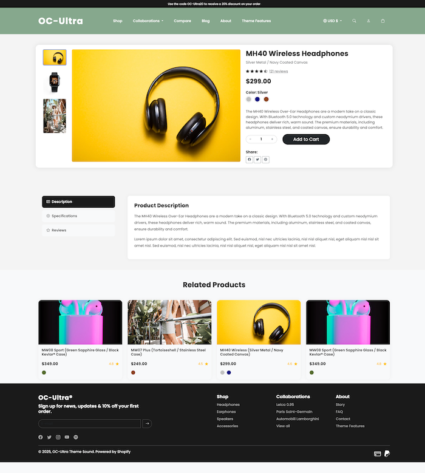
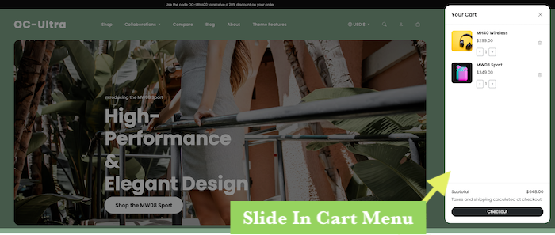
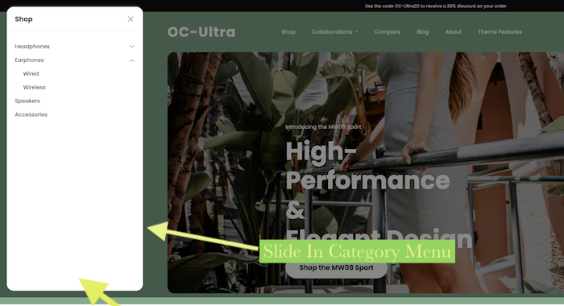
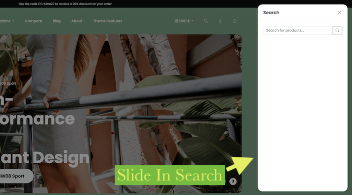

# Opencart OC-Ultra Theme

## Modern & Responsive E-commerce Theme for Opencart ( html css only as of now )

OC-Ultra is a cutting-edge Opencart theme designed to provide a sleek, modern, and highly responsive shopping experience. Built with a focus on user experience and aesthetic appeal, this theme is perfect for any online store looking to make a strong impression.

## Features

*   **Responsive Design:** Ensures your store looks great and functions flawlessly on all devices, from desktops to mobile phones.
*   **Intuitive Navigation:** Features smooth slide-in menus for Shop, Search, and a dedicated Cart section, providing quick and easy access to essential store functions without cluttering the main interface.
*   **Dynamic Product Pages:**
    *   **Image Gallery:** Showcase your products with a prominent main image and a convenient thumbnail gallery for multiple views.
    *   **Interactive Options:** Engage customers with color swatches that dynamically update product images.
    *   **Detailed Information Tabs:** Organize extensive product details, specifications, and customer reviews into clean, navigable tabs.
    *   **Review System:** Includes a user-friendly review widget with star ratings, encouraging customer feedback.
    *   **Related Products:** Boost sales and product discovery with a dedicated section for related items.
*   **Enhanced Category Listing:**
    *   **Visual Sub-categories:** Browse sub-categories with engaging image cards, making navigation more intuitive and visually appealing.
    *   **Advanced Sorting:** Allow customers to easily sort products by various criteria (price, name, etc.).
    *   **Pagination:** Seamlessly navigate through extensive product listings with clear and well-styled pagination.
*   **Modular CSS Architecture:** Refactored stylesheets (`layout.css`, `home.css`, `product.css`, `category.css`) ensure clean, maintainable, and easily customizable code.
*   **Bootstrap 5 Integration:** Leverages the power of Bootstrap 5 for a robust and flexible front-end framework.
*   **Optimized for Performance:** Clean code and efficient structure contribute to faster loading times and a better user experience.

## Screenshots

### Home Page

### Product Page

### Category Page

### Cart Slide In

### Slide In Menu

### Search Slide In

## Installation

This is HTML CSS , you will need Opencart developer to implement it as theme however the html Css work done is according to Opencart Bootstrap 5.

## Support

support@iextendlabs.com 
